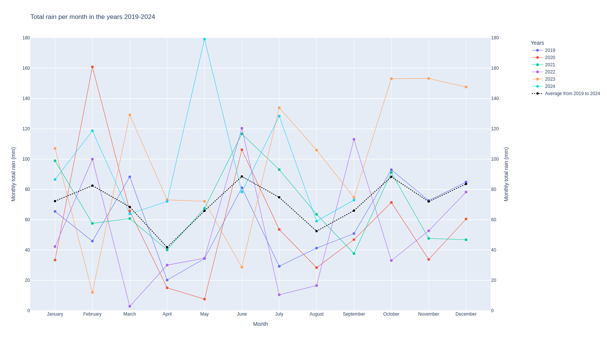
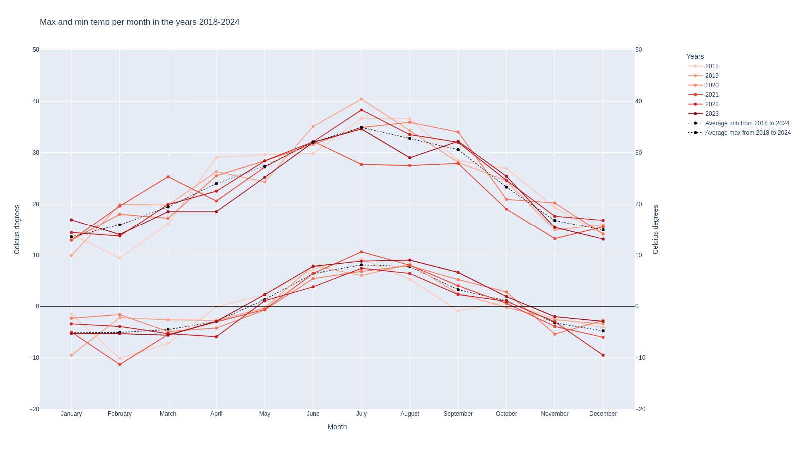
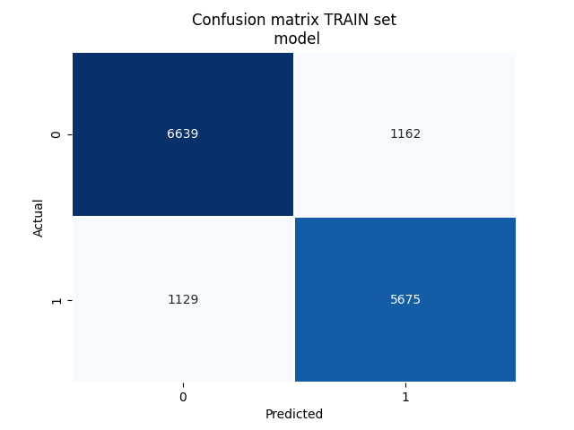
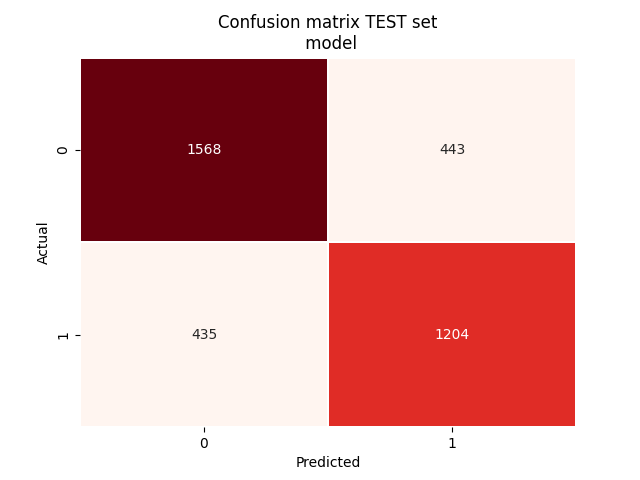
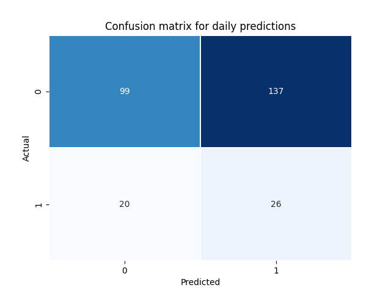

# A rainfall prediction repo
This is an MLOps/Data Visualisation project for Dutch weather, demonstrated via a [streamlit app](https://rainfall-prediction-app-volkan-ai.streamlit.app/), which provides:

- Actual station readings from the stations in Amsterdam, Rotterdam, Eindhoven and Maastricht
- Monthly dashboards on rainfall ammounts and temperatures
- Recent predictions and actual rainfall in selected stations 

The repo includes getting data via [KNMI API](https://dataplatform.knmi.nl/), CI/CD via `Github Workflow` and front end via [Streamlit](https://streamlit.io/).  The purpose is to have an up-and-running ML pipeline. Everything is scheduled and automated using Github actions from data ingestion, model training and inference.

It should be noted that the predictions are meant for demonstration purposes only. Making reliable meterological forecasts is a much more computationally intensive task than what is intended here. 

The visualisations can be found in the streamlit app: https://rainfall-prediction-app-volkan-ai.streamlit.app/ 

The working mechanism is as follows:

## Github Workflow Actions (YML files in `.github/workflows`)
As the name suggests these files invoke scheduled actions for retrieving historical and daily data, training ML model and feeding the data to source the front end (i.e. streamlit app). The actions invoke  python scripts on schedule:

### 1. Retrieve data from KNMI 
**`set_dates_for_training.py`**

In order to get the historical dataset and make the `POST` request to KNMI website, we set the starting and end dates. Starting date is 10 years ago and end date is 1 month ago from today. Invoked on Sundays at 05:00 UTC. 

**`get_historical_rain_data_from_knmi.py`**

Here, we make a `POST` request to KNMI's website (Dutch Meteoology website) using `requests` lib from python (quite handy, kudos to them). The retrieved file includes the actual rainfall data for the last 10 years for Eindhoven airport. Invoked on Sundays at 05:00 UTC.

After getting the data, there is some data preparation going on to have a ready dataset for training the LGBM models (feel free to call it *data munging, wrangling* etc for increased marketability).   

- **Input**: The `env` variables `starting date` and `ending date`
- **Output**: Historical rainfall amounts (`files/historical_rain_data.csv`)

 **Features used for training the prediction model**
|  Feature name | Explanation  |
|---|---|
| month_name |Name of the month, e.g. January, February,...|
| season| Season, e.g. Winter|
| wind_direction`  | Average wind direction  |
| mean_wind_speed| Average wind speed|
| mean_temp|Average temperature|
| min_temp|Minimum temperature|
| max_temp|Maximum temperature|
| mean_pressure|Average atmospheric pressure|
| max_pressure|Maximum atmospheric pressure|
| min_pressure|Minimum atmospheric pressure|
| max_humidity|Maximum humidity|
| min_humidity|Minimum humidity|
| rain_duration|Duration of rain (in hours)|
| rain_amount_mm|Total rain amount throughout the day|
| time_of_max_rain|The time slot where max rain occurred |

**`create_monthly_dashboard_data.py`**
At this step, we retrieve historical data using KNMI API in order to provide visualisations such as the following below. The data feeds the streamlit app (i.e. `streamlit_app.py`). This script is invoked at day 1,7,14,24 every month at 05:00 UTC.

- **Output**: Historical rainfall and temperature data (`files/monthly_dashboard_df.csv`)

**`create_monthly_plots.py`**
Here, static images are plotted and saved in `images` folder. 

- **Input**: Historical rainfall and temperature data (`files/monthly_dashboard_df.csv`)
- **Output**: Monthly static visualisations 

**Example plots**

 

 

### 2. Train the prediction models and make predictions 
(`train_rainfall_model.yml`,`predict_daily_rainfall.yml`)

**`train_rainfall_model.py`**

Here, we train two `LGBM` models, one regression and one classification using 80/20 Training/Testing data split. The split is made taking the chronological order into account (i.e. first 8 years is training, last 2 years is testing data). Regression model predicts the rainfall amount in mm. Classification predcits whether or now it will rain, i.e. rainfall>=0.1 mm. The two models are exclusive. 

Using classification models, we also provide the probability of rainfall. 

Here, obviously we are not trying to have a full blown weather model. The whole purpose is to have **A** decent model, and make reasonable predictions. 

- **Input**: Historical rainfall (`files/historical_rain_data.csv`)
- **Output**:
  - LGBM models - classification and regression (`files/rainfall_models.pickle`).
  - `files/train_test_set_comprehensive.csv` includes detailed data on training and testing set, errors, etc for tracking purposes if/when things go south.
  - `images` folder includes the confusion matrices where 1: Rain, 0: No rain. For example:
    
  

**`predict_daily_rainfall.py`**

Using the saved models as `pickle` files, we get daily data similar to `get_daily_rain_data_from_knmi.py` and make predictions. Here, we use the latest model trained before. We call this step "the inference part".

- **Input**: LGBM models - classification and regression (`files/rainfall_models.pickle`)
- **Output**: Daily predictions file (`files/daily_prediction.csv`). Each row will be a prediction made at each day. For that reason, the file is written in `append` mode.

**`make_plots_for_predictions.py`**

Here we plot actuals, predictions and errors of the ML model. 

- **Input**: Daily predictions file
- **Output**: Plots

**Confusion matrix using the classification models. 1: Rain, 0: No rain**

 

## Front end with Streamlit
**`streamlit_app.py`**
The [front end](https://rainfall-prediction-app-volkan-ai.streamlit.app/) is created via the aforementioned python script. Here there are three groups of visualisations that are interactive. The user can choose the stations of interest and the date range to modify data visualisations:

- *Latest measurements*: The readings from stations taken every half hour via KNMI API, such as rainfall amount, temperature, wind speed etc

Example:

- *Monthly plots*: The rainfall and temperature is plotted per month for the last 10 year to provide the monhtly figures and evolution through the years. User is expected to choose a location.

Example:

- *Predictions vs Actuals*: The actual rainfall amounts, the predictions and the error is plotted for the last couple of weeks. User is expected to choose a specific location. 

Example:

