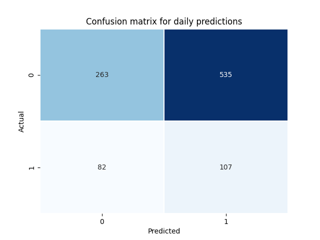

*"Devoted to those, who never fails to type 'predction' incorrectly"*

# A simple rainfall prediction repo
Some `yml` and `python` scripts to practice ML Ops. Nothing fancy, just to have an ongoing MLOps project. The purpose is to have an up-and-running ML pipeline. Everything is scheduled and automated using Github actions from data ingestion, model training and inference. No manual trigger needed.

The structure is as follows:

## Workflow actions (YML files in `.github/workflows`)
As the name suggests these files impose scheduled actions. The actions invoke  python scripts on schedule:

### 1. Retrieve historical data from KNMI (`get_historical_rain_data.yml`, scheduled on Sundays at 12:00 UTC): 
**`set_dates_for_training.py`**

In order to get the historical dataset and make the `POST` request to KNMI website, we set the starting and end dates. Starting date is 10 years ago and end date is 1 month ago from today. Invoked on Sundays at 12:00 UTC. 

**`get_historical_rain_data_from_knmi.py`**

Here, we make a `POST` request to KNMI's website (Dutch Meteoology website) using `requests` lib from python (quite handy, kudos to them). The retrieved file includes the actual rainfall data for the last 10 years for Eindhoven airport.

After getting the data, there is some data preparation going on to have a ready dataset for training the LGBM models (feel free to call it *data munging, wrangling* etc for increased marketability).   

- **Input**: The `env` variables `starting date` and `ending date`
- **Output**: Historical rainfall amounts (`files/historical_rain_data.csv`)

 **Features:**
|  Feature name | Explanation  |
|---|---|
| month_name |Name of the month, e.g. January, February,...|
| season| Season, e.g. Winter|
| wind_direction`  | Average wind direction  |
| mean_wind_speed| Average wind speed|
| mean_temp|Average temperature|
| min_temp|Minimum temperature|
| max_temp|Maximum temperature|
| mean_pressure|Average atmospheric pressure|
| max_pressure|Maximum atmospheric pressure|
| min_pressure|Minimum atmospheric pressure|
| max_humidity|Maximum humidity|
| min_humidity|Minimum humidity|
| rain_duration|Duration of rain (in hours)|
| rain_amount_mm|Total rain amount throughout the day|
| time_of_max_rain|The time slot where max rain occurred |

### 2. Train the prediction models (`train_rainfall_model.yml`, scheduled on Sundays at 13:00 UTC)
**`train_rainfall_model.py`**

Here, we train two `LGBM` models, one regression and one classification using 80/20 Training/Testing data split. The split is made taking the chronological order into account (i.e. first 8 years is training, last 2 years is testing data). Regression model predicts the rainfall amount in mm. Classification predcits whether or now it will rain, i.e. rainfall>=0.1 mm. The two models are exclusive. 

Using classification models, we also provide the probability of rainfall. 

Here, obviously we are not trying to have a full blown weather model. The whole purpose is to have **A** decent model, and make reasonable predictions. This step is invoked scheduled on Sundays at 13:00 UTC. 

- **Input**: Historical rainfall (`files/historical_rain_data.csv`)
- **Output**:
  - LGBM models - classification and regression (`files/rainfall_models.pickle`).
  - `files/train_test_set_comprehensive.csv` includes detailed data on training and testing set, errors, etc for tracking purposes if/when things go south.
  - `images` folder includes the confusion matrices where 1: Rain, 0: No rain. For example:
    
  

### 3.  Get daily data and make predictions for tomorrow (`predict_daily_rainfall.yml`, scheduled every day at 14:00 UTC)

**`predict_daily_rainfall.py`**

Using the saved models as `pickle` files, we get daily data similar to `get_daily_rain_data_from_knmi.py` and make predictions. Here, we use the latest model trained in Step 3. We call this step "the inference part".

Yesterday's data is taken and a prediction for tomorrow is added to the predictions file cumulatively. As such, we track the performance of the system, scheduled  everyday at 14:00 UTC. 

- **Input**: LGBM models - classification and regression (`files/rainfall_models.pickle`)
- **Output**: Daily predictions file (`files/daily_prediction.csv`). Each row will be a prediction made at each day. For that reason, the file is written in `append` mode.

### 4.  Visualize predictions (`make_plots_for_predcitions_made.yml`, scheduled every day at 14:30 UTC)

**`make_plots_for_predictions.py`**

Here we plot actuals, predictions and errors of the ML model. The first plt visualizes the amount of actual rainfall, predictions and the error in mm. The second plot visualizes the confusion matrix for actual rain occurrence and prediction. Scheduled everyday at 14:30 UTC (can also be integrated with Step 3 easily).

- **Input**: Daily predictions file
- **Output**: Plots

**Predictions vs actual rainfall (in mm) plotted against days (`YYYYMMDD` format). Regression model used**

 

**Confusion matrix using the classification models. 1: Rain, 0: No rain**

 
